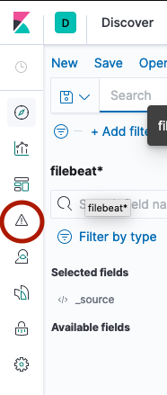

# How to Write Alerts

In order for alerts to work, [SMTP needs to be configured](smtp.md).

## Using Elastalert in Kibana

In Kibana the Elastalert plugin window can be found by clicking the triangle with the exclamation mark on the sidebar.



The alerts should be kept simple. If the alerts are complex, it's likely a better idea to [write better queries](writing-queries.md).

If the queries maintain the format described in [writing-queries](writing-queries.md) then this alert should be the only alert required:
```
es_host: elasticsearch-master
es_port: 9200
name: Is there anything that's not compliant?
index: filebeat-*
type: any
filter:
- query:
    query_string:
      query: "snapshot.compliant:0"
alert:
  - "email"
email:
  - "<alert_sent_to_here>@example.com"
```

## When will I get an alert?
The email specified in the above alert will receive an email as often as specified in the [the elastalert ConfigMap](../templates/elastalert-configmap.yaml).

NB: Due to the implementation of the [bitsensor elastalert](https://github.com/bitsensor/elastalert) docker image used, the elastalert Pod needs to be restarted for any changes to this ConfigMap to take effect.

As of writing this also means that any alerts stored in elastalert will be deleted and will need to be reapplied. Thus, it is recommended alerts are stored in the [/elastalert](../elastalert/) folder for backup and versioning.