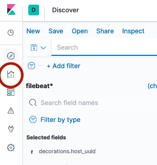
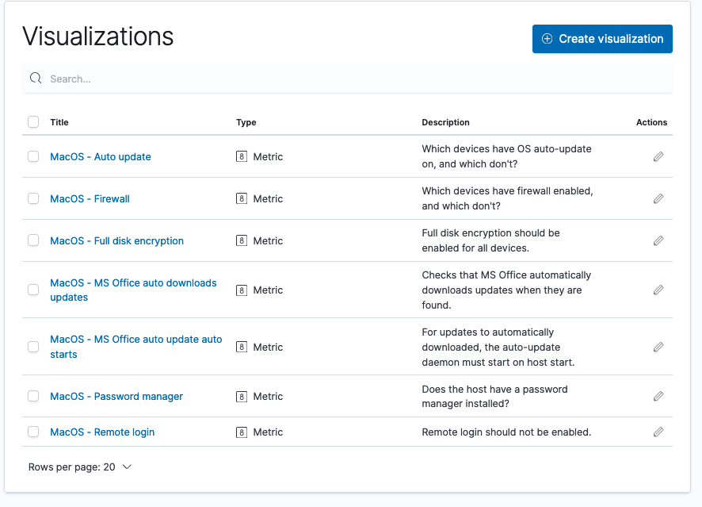
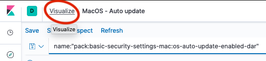
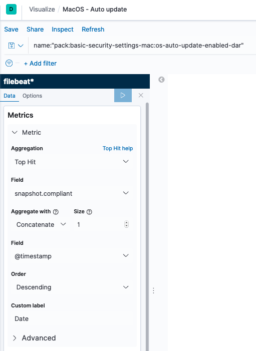
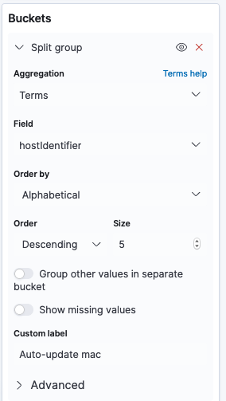

# Kibana visualisations

> This is likely already done for you, so you won't need to create new metrics.

This outlines how you should create visualisations, in particular, metrics in Kibana, such that it's easy to determine compliance failures on endpoints. Most of the time your admin should have already setup these metrics.

Much of this depends on if you [wrote the queries to the standard documented](writing-queries.md).

## Creating a new metric
1. Go to the visualisations menu, which should be third from the top on the left sidebar, as in image below:
   

The page you are now on should look like this:

If you are not seeing that page, and are instead seeing a particular visualistion, click the "Visualize" link at the top of the page, like the image below.

2. From here, the easiest way to click and open an existing metric, but you can create from new if you like.

Once open, you should see the options look similar to below:

### What is happening here?

**Metrics**

Firstly, we use the "Top Hit" aggregation, and use @timestamp as the "aggregate with" field, in descending order, then taking just 1 (size = 1) log. This means that we will only look at the latest log sent for each log of a particular *bucket*

**Buckets**

We create buckets on a "Terms" aggregation and use field hostIdentifier or, if configured like [here](../dev-docs/packaging-launcher.md), then email. Any unique device identifier can be used here.

In combination with the metrics filter, the final result, asks a question like:
"What is the latest snapshot.compliant result for each of the hosts?"

However, the latest snapshot.compliant result could have come from any of the queries. Thus, we also include a search filter for a particular query in the top bar. In this case, we are checking the status of MacOS's auto-update setting.

3. In order to write a new metric for a new query, all you have to do is change the search at the top. Assuming the query will return 0 for a failure, as it should, that is all that is required.
