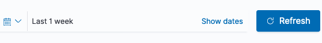
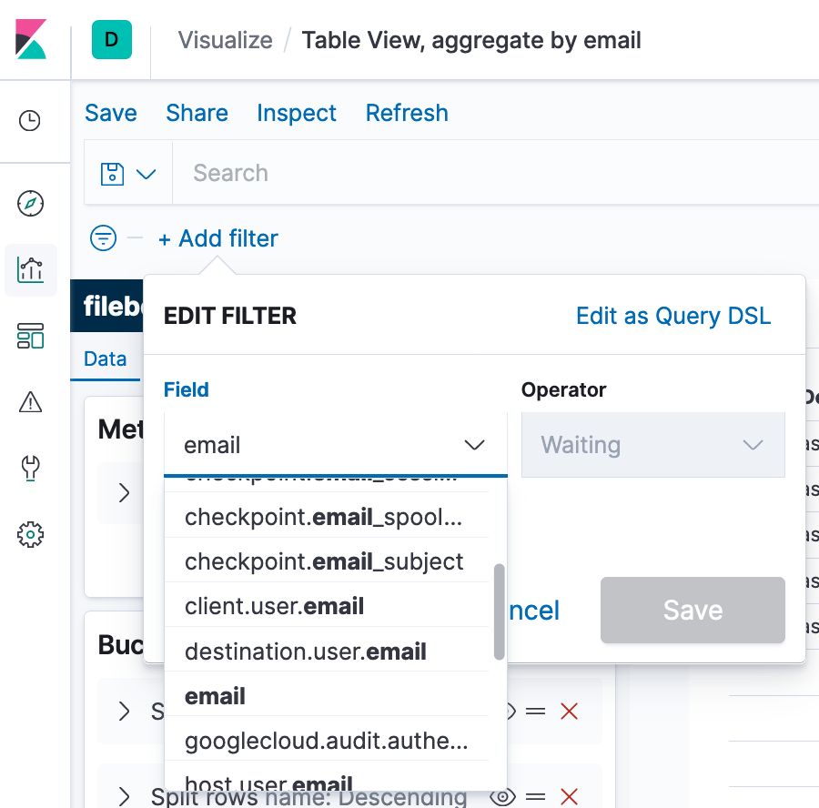
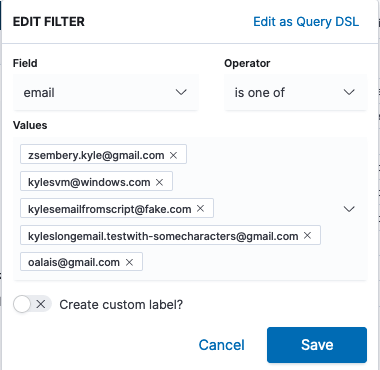
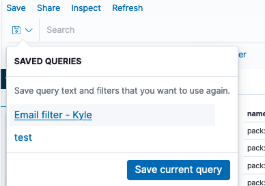
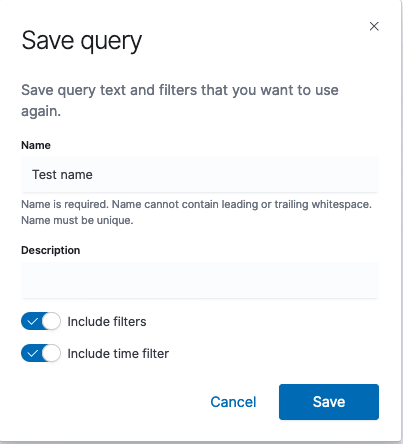
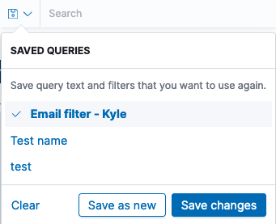

# How to use the Kibana Dashboard

This document will briefly outline a clean process of using kibana. It will show you to to create a 'filter' which will allow you to just search for the results of a particular set of emails.

> If you are not seeing the results you expect, or any results at all, please ensure you have the time range set correctly. You can set this in the top right of the screen in Kibana, next to the search bar. It is advised to set from a week ago until now, using the "relative" time, based on the query schedule being used here.

## How to save a new group of emails

1. Enter into the table dashboard. And ensure the time frame (top right of screen) is set to a relative date 1 week ago. This is likely already done for you. See screenshot:

2. Click "+ Add filter" just under the search bar at top of screen, on the left.

3. Select the "email" field.
   > Note there are a number of other email fields but you do not need to worry about these, select as in the screenshot below:

You want to select just the field that says "email".

5. In the "Operator" drop down, select "is one of"
6. Click "Select values", a drop down should popup allowing you to select emails from an autocomplete list. If you start typing an email, the list will narrow.

After completion it should look something like:

.

7. Click "Save".

   > This does NOT save it for reuse yet. Check that you have the results you want before continuing, to save for easy reuse.

8. Click the save box on the left of the search bar, as in the screenshot.

9. Click "Save current query". Provide a clear, identifiable name for the query. And a description if desired.

10. Ensure "Include filters" and "Include time filter" are both enabled, as in the screenshot below:

Now the filter is saved for reuse.

## Using the email group filter

Simply open the savd queries menu and click the query name that you provided when creating it, as in the below screenshot:

## Updating the email group filter

1. Click the Saved Queries button to the left of the search bar
2. Open open the query you wish to update
3. Update the list of emails to show what you want
4. Click the Saved Queries button to the left of the search bar again
5. Save changes

## Deleting an email group filter

1. Open the Saved Queries
2. Hover the query you wish to delete
3. Click the red trash can on the right of the query name
4. Delete
