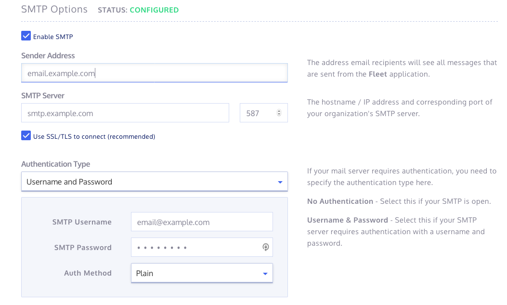

# Setting up SMTP
In order for Elastalert to send alerts via email, it must be able to connect to an SMTP server. 

You will also need SMTP enabled on the fleet server to enable some features like having multiple users. This is important so not everyone has admin privileges.

**NOTE: On Linode, the mail ports 25, 465 and 587 are blocked by default for new users. You may have to ask them to open the ports.**

## Setup SMTP for Elastalert
1. Find the SMTP details for the email provider you wish to use to send emails from.
For gmail it will look something like this:

        Outgoing Mail (SMTP) Server: smtp.gmail.com
        Use Authentication: Yes
        Use Secure Connection: Yes (TLS or SSL depending on your mail client/website SMTP plugin)
        Username: your Gmail account (e.g. user@gmail.com)
        Password: your Gmail password
        Port: 465 (SSL required) or 587 (TLS required)

2. Open up the `values.yaml`
3. In there you want to set:
   ```
    # NB: username and password comes from values.secret.yaml
    smtp:
      host: smtp.gmail.com
      # You must use the SSL port (465) with this plugin
      port: 465
      useTLS: true
      # where the email appears to come from (best to set to the actual from address)
      # which is set in values.secret.yaml as 'user'
      fromAddress: example@gmail.com
   ```
If using gmail, all except the `fromAddress` can remain the same.

3. You will need to put your email secrets in values.secret.yaml (this value file is kept out of source control, to stop the leaking of credentials).

```
email:
  user: example@gmail.com
  password: verySecureUncompromisedPassword
```

## Setup SMTP for Fleet
You must enable SMTP in Fleet to enable the user management functionality (e.g. resetting passwords, creating/inviting users).

1. Sign in as an admin user
2. Click admin on the left sidebar, and then App Settings
3. Scroll to the SMTP and enter details

4. Click 'Update Settings' at the bottom of the page. 

If everything is configured correctly you should get a success message at top of screen and SMTP Options should say `Status: CONFIGURED` as in the image. 